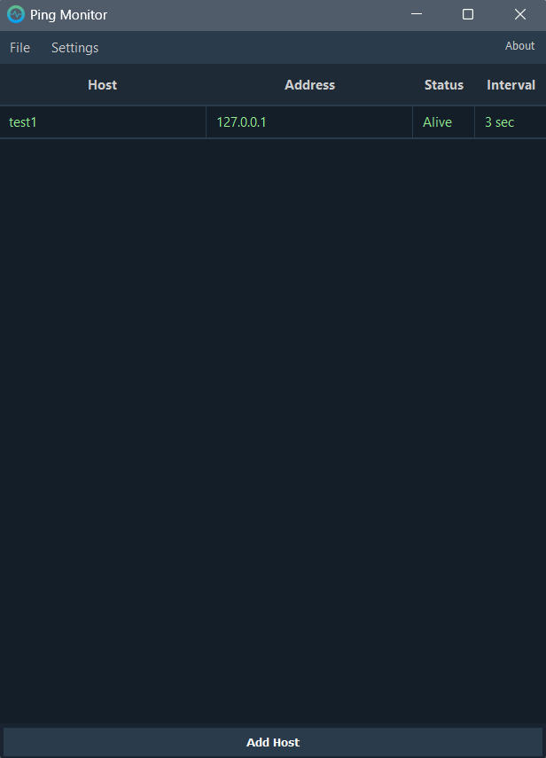

# Ping Monitor


A lightweight host-availability monitor for Windows. It pings a list of hosts in the
background, lives quietly in the system tray, and shows a notification the moment a
host goes down.

<!-- The demo GIF lives in the docs/ folder of the repo -->


## Features

- **Continuous monitoring** — pings each host on its own interval over ICMP.
- **System tray** — runs in the background; the tray icon turns red when any host is down.
- **Desktop notifications** — get alerted when a host is marked dead.
- **Configurable failure threshold** — choose how many failed pings in a row count as
  "down", so a single dropped packet doesn't trigger a false alarm.
- **Per-host intervals** — monitor critical hosts more often than the rest.
- **Drag & drop ordering** — rearrange hosts in the list.
- **Import / export** — share host lists as JSON.
- **Reliable status** — distinguishes a real reply from a router's
  "Destination host unreachable", so the status doesn't flicker.

## Download

Grab the latest `PingMonitor.exe` from the [**Releases**](https://github.com/rykovgeka/PingMonitor/releases) page.
No installation required — just run it.

> **Note on SmartScreen / antivirus:** because the build is not code-signed, Windows
> may show a *"Windows protected your PC"* dialog (click **More info → Run anyway**),
> and some antivirus engines may flag it with a false positive. This is a known quirk of
> unsigned PyInstaller executables and is unrelated to what the app does. You can always
> review the source and build it yourself (see below).

## Usage

1. Launch the app and click **Add Host**.
2. Enter a name, an address (IP or hostname), and a check interval in seconds.
3. The status column shows **Alive** / **Dead**; the tray icon reflects the overall state.
4. Close to tray with minimize; quit fully via **File → Exit** or the tray menu.

Settings (notifications, start minimized, failure threshold) live under the **Settings**
menu. Your hosts and preferences are saved automatically next to the executable in
`hosts.json` and `settings.ini`.

## Build from source

Requires Python 3.8+ and PyQt5.

```bash
pip install pyqt5 pyinstaller

pyinstaller --onefile --windowed --icon=PingMonitor.ico --add-data "PingMonitor.ico;." --name PingMonitor ping_monitor.py
```

The standalone `PingMonitor.exe` will be created in the `dist/` folder.

> On Linux/macOS, change the `--add-data` separator from `;` to `:`.

To run directly without building:

```bash
python ping_monitor.py
```

## License

Released under the [MIT License](LICENSE).

---

Built with Python and [PyQt5](https://pypi.org/project/PyQt5/).
